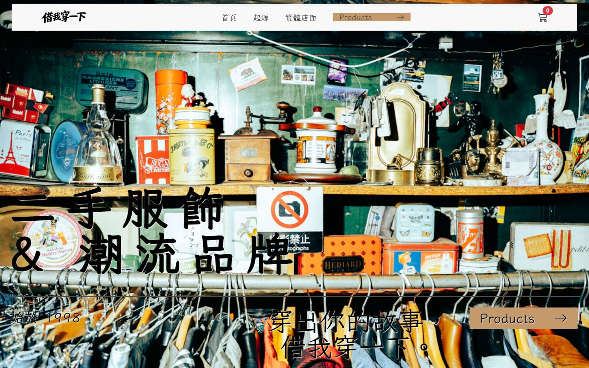
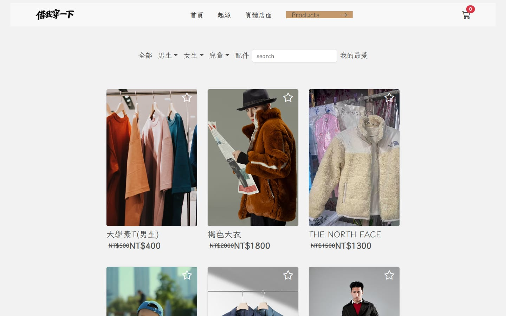
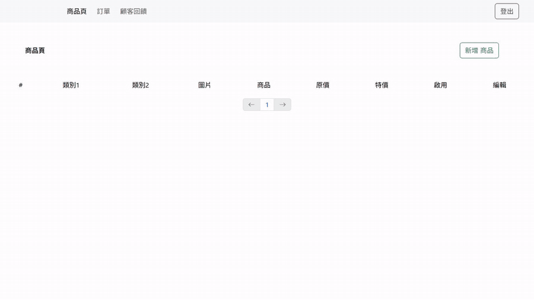

# 借我穿一下 | 二手潮流服飾共享平台

二手潮流服飾共享平台，包含前台購物流程與後台管理系統。前台版面以 SCSS 自行切版，後台可管理商品、訂單與首頁的顧客回饋。

🔗 [線上 Demo](https://hthoftt.github.io/react-vite-work2/) · [後台登入頁](https://hthoftt.github.io/react-vite-work2/#/login)

| 首頁 | 商品列表 |
|---|---|
|  |  |

**後台操作：商品、顧客回饋、訂單篩選與管理**（後台需登入，以下為操作錄影）



## 功能

**前台**
- 首頁：顧客回饋卡片捲動到畫面時依序淡入（IntersectionObserver）
- 商品列表：依分類與尺寸篩選，可再搭配關鍵字搜尋
- 我的最愛：點星號收藏商品，存在 localStorage，換頁與重新整理後仍保留
- 側邊購物車：不用換頁就能增減數量、刪除商品
- 導覽列：往下捲動時自動隱藏，往上捲動時出現
- 結帳：顯示購物車明細，React Hook Form 驗證手機（09 開頭 10 碼）與 Email 格式，送出時防止重複下單
- 關於我們頁面、嵌入 Google 地圖

**後台**（需登入）
- 登入取得 token 存入 cookie，進入後台時驗證，未登入或 token 失效自動導回登入頁
- 商品管理：新增、編輯、刪除
- 訂單管理：一次取回所有分頁訂單，依已付款 / 未付款篩選並統計全部金額、修改付款狀態、刪除訂單
- 顧客回饋管理：新增、編輯、刪除，資料會直接顯示在前台首頁（以文章 API 儲存）

## 技術重點

- **自行切版**：前台每個頁面各自的 SCSS 模組，含 RWD
- **狀態共享**：商品、收藏、購物車放在 Layout，進站只取一次資料，透過 `useOutletContext` 傳給各頁面
- **Redux Toolkit**：以 slice + `createAsyncThunk` 管理全站 toast 通知，可同時顯示多則並自動移除
- **API 模組化**：`src/api.js` 以 axios instance 統一管理路徑，後台請求以 interceptor 自動帶入 token
- **拆分載入**：後台頁面以 `React.lazy` 拆開，前台訪客不用下載後台程式碼
- **原生 Web API**：IntersectionObserver 做進場動畫、scroll 事件控制導覽列
- **Oxlint**：程式碼檢查

## 使用技術

React 19 · Vite · React Router · Redux Toolkit · React Hook Form · axios · Bootstrap 5 · SCSS · Oxlint · GitHub Pages

## 本機執行

```bash
npm install
npm run dev
```

需在 `.env` 設定 `VITE_APP_API_URL` 與 `VITE_APP_API_PATH`。

建置：`npm run build`

## 作者

洪子祥 · [GitHub](https://github.com/hthoftt) · tonyhung92568@gmail.com
